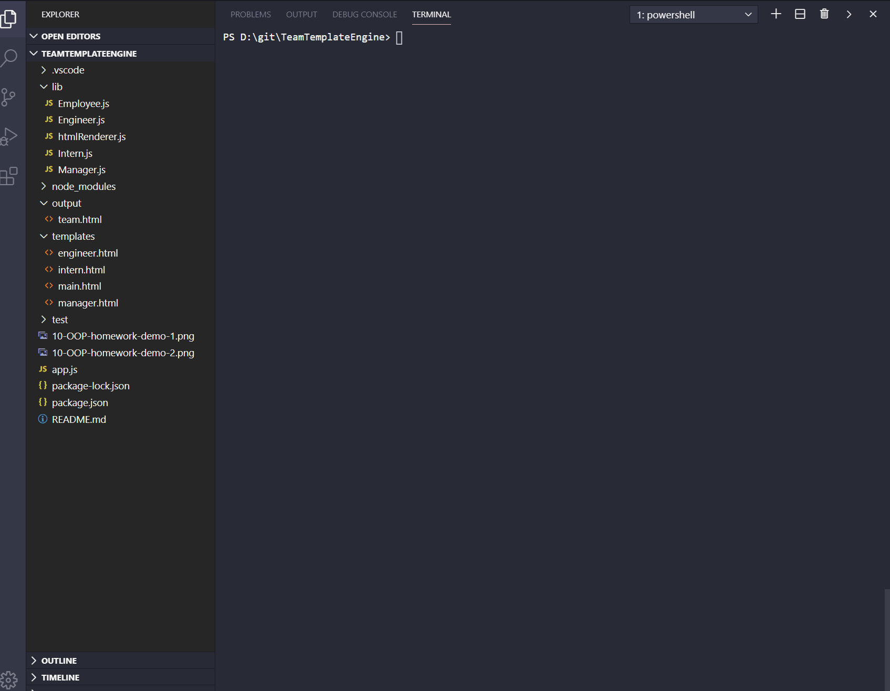
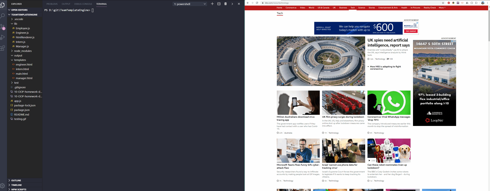

# Description

A small node cli executed script that will take user input to add members to a small team, then export the results in html.

# Table of Contents
* [User Story](#User%20Story)
* [Build Status](#Build%20Status)
* [Technology](#Code%20Style%20and%20Technology)
* [Use](#Usage)
* [Credits](#Credits)
* [Results](#Results)

# User Story
```
As a manager
I want to generate a webpage that displays my team's basic info
so that I have quick access to emails and GitHub profiles
```

# Current Build Status

Passed testing on 25th March 2020<br/>
Code production candidate pushed 27th March 2020

# Code Style and Technology
This has been developed with HTML5, CSS3 and Javascript, utilizing Visual Studio Code
Additional NPM packages: Inquirer
node_modules folder has been added to .gitignore

# Usage
TEAMTEMPLATEENGINE should be downloaded from git hub.<br/>
NPM install should be executed from the CLI to add required packages.<br/>
Run node app.js from the terminaal to execute the script.<br/>
Open the team.html file in the browser to see the results.

# Credits
Code study session - Travis Cultreri, Joy Chen

# Results
Testing passed as required:


Code executed as required:

